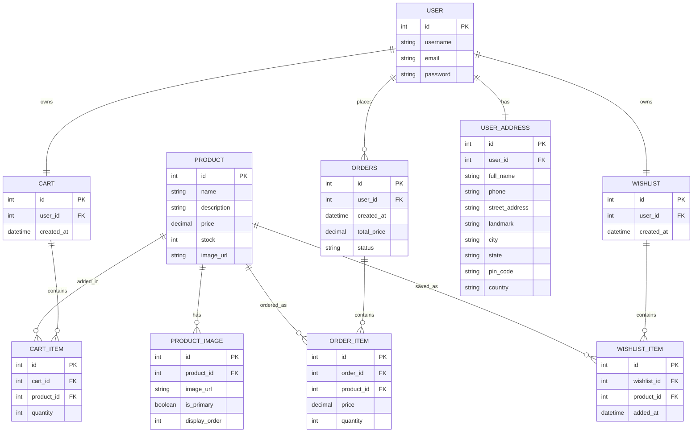
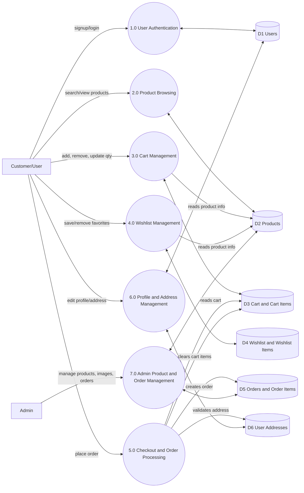
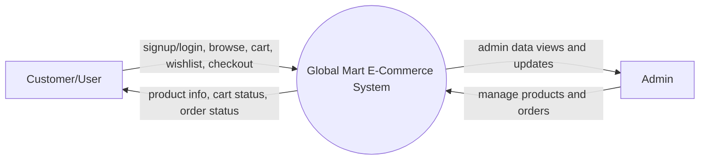

# ER and DFD Diagrams

## 1. ER Diagram (Entity Relationship)

## 2. DFD Diagram (Level 1)

## 3. DFD Diagram (Context / Level 0)

## Notes for Report Submission

- ER diagram is based on your implemented Django models in the store app.
- DFD Level 1 shows major processes and data stores used by your system.
- You can export these Mermaid diagrams to PNG/SVG using VS Code Mermaid preview or online Mermaid tools.
